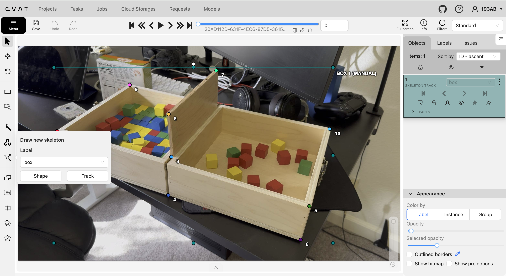

# Storage
Google drive: https://drive.google.com/drive/folders/1YqL_EXgGVSgUE8StAst-dKBM6HgvL_WS?usp=drive_link 
## File structure
### For `IMG_*` folders

These are the videos I shot, I made sure the box didn't move. So, There's only one `.txt` label file per video, which is used accross all frames.
You can use the following script to duplicate the labels and extract frames:
- [python script](../tools/generate_frames_n_labels.py)
- [bash script](../tools/generate_frames_n_labels.sh) (faster)

### For `*.tar.gz` files
These contains all the frames extracted from each video, and their corresponding label files.
```
video_name/
    frames/
        video_name_frame_000001.jpg
        video_name_frame_000002.jpg
        ...
    labels/
        video_name_frame_000001.txt
        video_name_frame_000002.txt
        ...
```

# Label more data
I use `cvat` to label the data locallly. Follow [installation guide](https://docs.cvat.ai/docs/administration/basics/installation/) to set it up locally. Or you can start with free trial on [cvat.ai](https://www.cvat.ai/) and pay as you go.

## Setup the project
In the project tab, click on the `+` button and select `create from backup`. Then upload the [box.zip](./box.zip) file. 

## Start labeling
1. Create a new task, put it in the project (`box`) you just created,upload the video file you want to label. If the box doesn't move throughout the video, you can upload a single frame instead.
2. Draw new skeleton, select `box` as the label and track.



**Notes:**
The keypoint 8 is front top of the divider, point 7 is back top of the divider.

**Quality of the labels:**
Zoom into the keypoint and make sure they are on the box. Labeling it on the edge sometime can be tricky, so make the labels a bit inside the box to be safe.

## Export the labels
Once you finish labeling, export the labels in `Ultralytics YOLO pose 1.0` format. Include the images as well. Rename the exported zip file to `<video name>.zip`. CVAT has it's own way of structing the files, but you can pass me the zip file at this point... 

